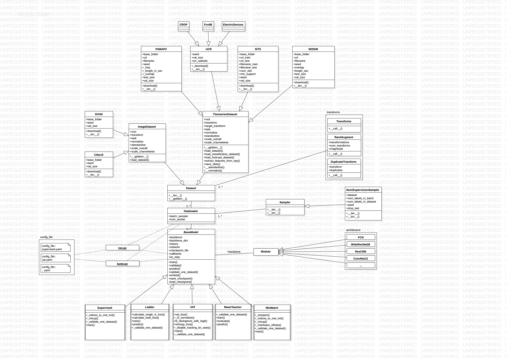

# SSLTSC

Codebase for our Paper [Deep Semi-supervised Learning (SSL) for Time Series Classification (TSC)](https://arxiv.org/abs/2102.03622) to appear at the ICMLA '21 

tldr: performance gains of semi-supervised models translate well from image to time series classification: 


## General

This framework allows the evaluation of the performance of SSL algorithms initially designed for image classification tasks on time series classification problems and their comparison with a different baseline models.

This pytorch-based codebase allows you to run experiments in a reproducible manner and to track and visualize your single experiments via [mlflow](www.mlflow.org/).
The core of this framework are two sub-packages `dl4d` for data loading and sampling in a semi-supervised manner and `ssltsc` which contains different backbone architectures, baseline models and the semi-supervised learning strategies.
To control the hyperparameters and general arguments for the model runs, you want to use the `config` files specifying single experiments in `ssltsc/experiments/config_files`.
Hyperparameter tuning is possible based upon this config file syntax using Hyperband as implemented in [optuna](www.optuna.org/).

All models in this repository were developed using image classification datasets (Cifar10, SVHN) as comparison to validate the correctness of the code. This means, you can use it not only for semi-supervised time series classification but also as a starting point for semi-supervised image classification.

The core functionalities of this framework are also tested in a series of unit tests.
Run `python -m unittest discover -s tests` from the parent level of this repository to test those crucial parts of the framework via the `unittest` framework. CI will be integrated on top of these tests soon. 

The following UML diagram gives a detailed overview on the different components of this framework: 

## Get Started

Install the `requirements.txt` in a clean python environment via `pip install -r requirements.txt`. Then install the module `ssltsc` by running `pip install -e .` from the parent level of this repository.

## Examples

The following are some examples on how to train or tune different algorithms on different datasets using this framework. Datasets are downloaded to the folder `data` on the fly if they are used the first time. These code-snippets should be run from `ssltsc/experiments`. Then

To train a `mixmatch` model with an FCN backbone on the `pamap2` Dataset for `1000` update steps storing the results in the mlflow experiment `hello_mixmatch_fcn`, run:

```
python run.py --config config_files/mixmatch.yaml --n_steps 1000 --dataset pamap2 --backbone FCN --mlflow_name hello_mixmatch_fcn
```

To verify the correct implementation of the `virtual adversarial training` (VAT) model on `cifar10` with a `wideresnet28` backbone run:

```
python run.py --config config_files/vat.yaml --dataset cifar10 --backbone wideresnet28
```

To run a Random Forest baseline based on features extracted via `tsfresh` from the `SITS` dataset on `250` labelled samples only, run:

```
python run_baseline.py --config config_files/randomforest.yaml --dataset sits --num_labels 250
```

And finally to tune the hyperparameters of the `meanteacher` model on the `crop` dataset for 10 hours on `1000` labelled samples, run:

```
python tune.py --config config_files/meanteacher.yaml --num_labels 1000 --time_budget 36000
```

## Integrated Algorithms and Datasets

### Algorithms

All algorithms are stored in `ssltsc.models`. Currently, the following semi-supervised algorithms are implemented within this framework:

* Mixmatch by [Berthelot et al. (2019)](https://arxiv.org/abs/1905.02249)
* Virtual Adversarial Training by [Miyato et al. (2017)](https://arxiv.org/abs/1704.03976)
* Mean Teacher by [Valpola et al. (2017)](https://arxiv.org/abs/1703.01780)
* Ladder Net by [Rasmus et al. (2016)](https://arxiv.org/abs/1507.02672)
* Self-supervised Learning for TSC by [Jawed et al. (2020)](https://link.springer.com/chapter/10.1007/978-3-030-47426-3_39)

and the following baseline models:

* Supervised baseline model
* Random Forest (based on features extracted via [tsfresh](https://tsfresh.readthedocs.io/en/latest/))
* Logistic Regression (based on features extracted via [tsfresh](https://tsfresh.readthedocs.io/en/latest/)


### Datasets

All integrated datasets can be found at `dl4d.datasets`. This framework currently contain the following TSC datasets:

* [WISDM](https://www.cis.fordham.edu/wisdm/dataset.php)
* [Pamap2](https://archive.ics.uci.edu/ml/machine-learning-databases/00231/PAMAP2_Dataset.zip)
* [SITS](http://cloudstor.aarnet.edu.au/plus/s/pRLVtQyNhxDdCoM/download?path=%2FDataset%2FSITS_2006_NDVI_C%2FSITS1M_fold1&files=SITS1M_fold1_TRAIN.csv)
* [Crop](http://www.timeseriesclassification.com/description.php?Dataset=Crop)
* [FordB](http://www.timeseriesclassification.com/description.php?Dataset=FordB)
* [Electric Devices](http://www.timeseriesclassification.com/description.php?Dataset=ElectricDevices)

as well as these standard image classification datasets to validate the implementation

* Cifar10
* SVHN